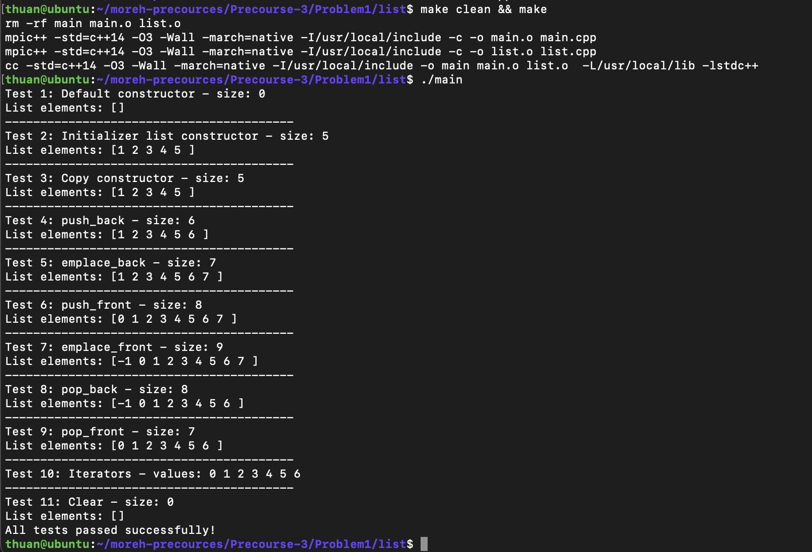
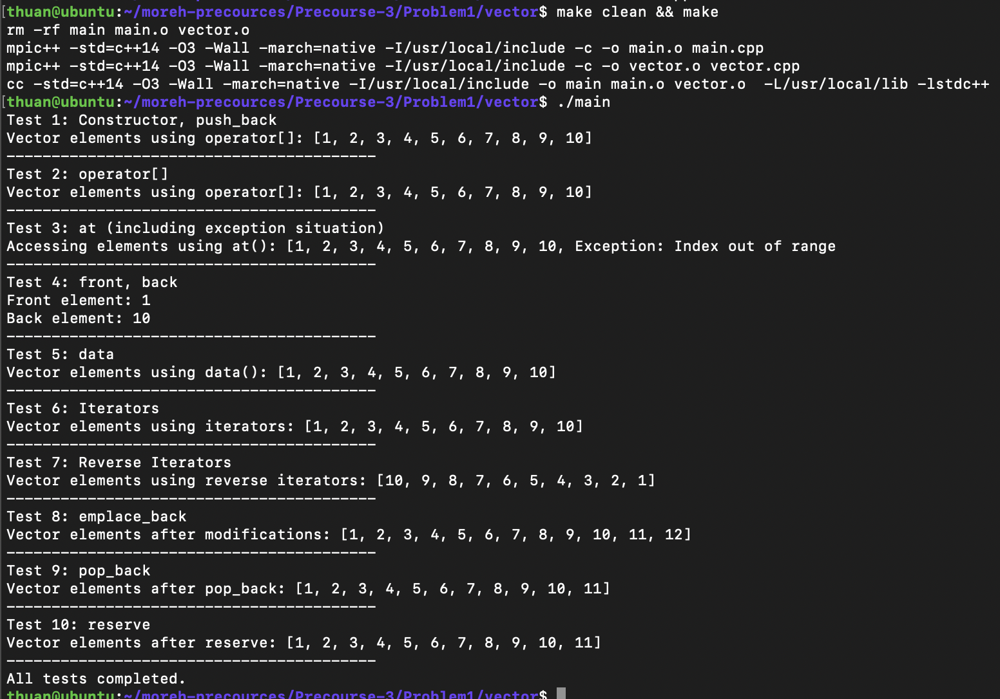
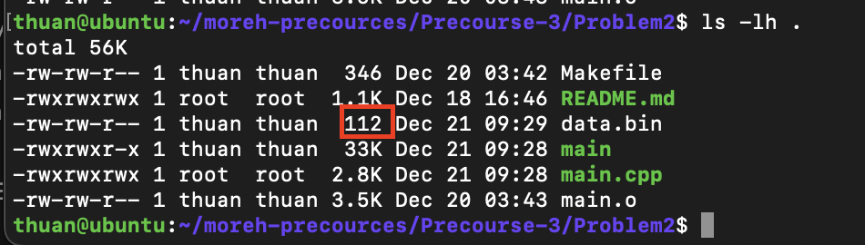
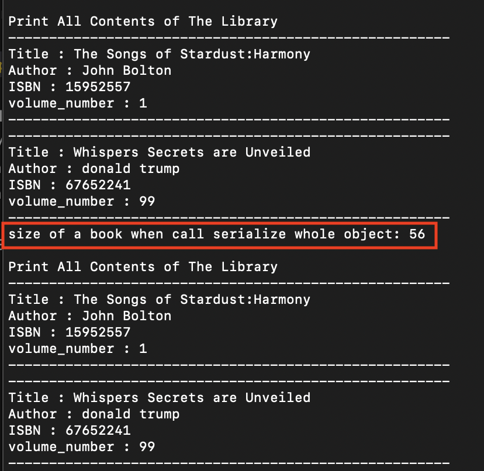
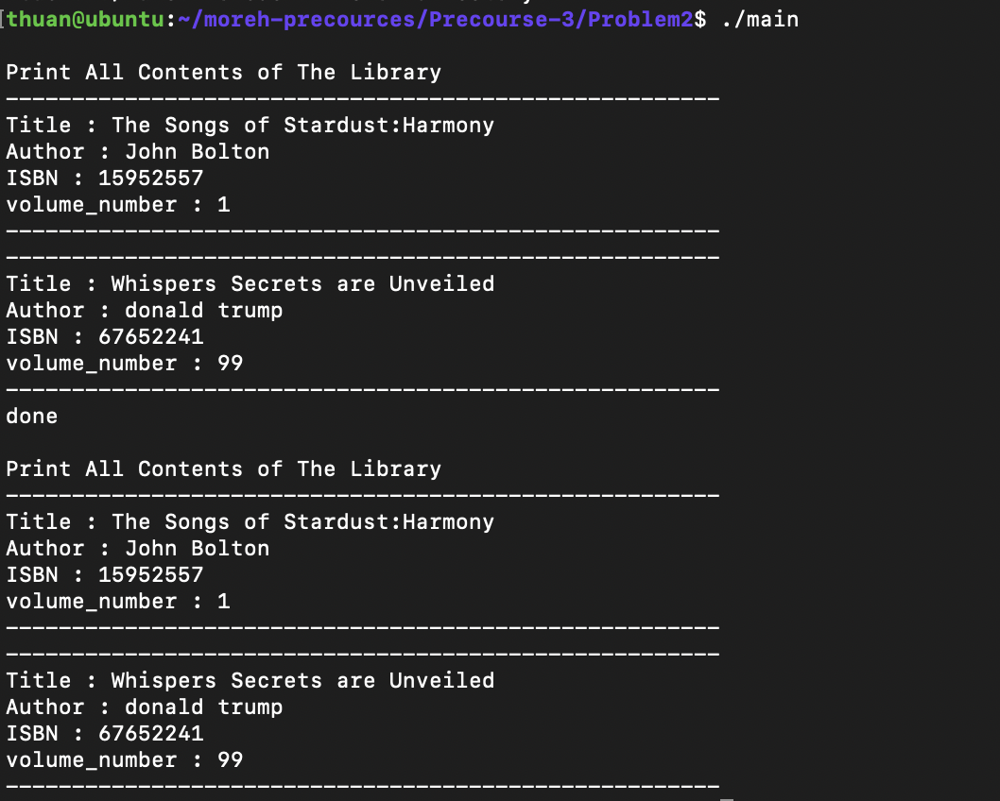
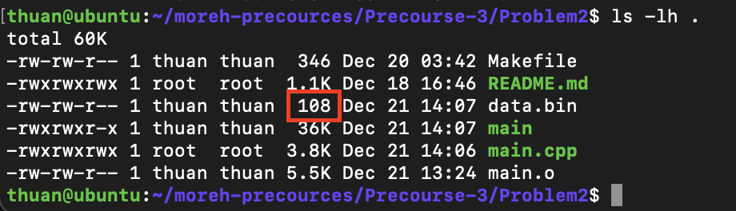
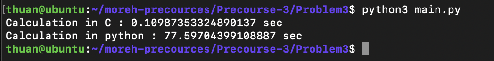

# Precourse 3

## Problem 1

### List

#### Node

The `Node` class need to implement contructor:

```
data = value;
next = nullptr;
prev = nullptr;
```

The `nullptr` has type std::nullptr_t, which can implicitly converted to any pointer type, we shouldn't assign `next = NULL` or `prev = NULL` because it will cause ambiguity in overloaded function in this case:

```
f(int);
f(foo *);
```

#### Iterator

`iterator(Node *node)` :
This function will assign the attribute `current` to the node by

```
this->current = node;
``````

`iterator::operator*()`:
This function return the data in the current node of iterator, implement this by

```
return this->current->data;
```

`iterator::operator++()`:
This function overrides prefix increment of iterator, coressponding to `++x`, which means increase value of `x` then assign it to other variable.

```
current = current->next;
return *this;
```

`iterator::operator++(int)`:
This function overrides postfix increment of iterator, coresponding to `x++`, which means assign value of `x` first, then increases `x`.

```
auto temp = iterator (current);
current = current->next;
return temp;
```

`operator!=(const iterator &other)`:
This function will compare 2 iterator to decide whether it point to the same node:

```
return this->current != other.current;
```

#### list member function

`list()`:

This is an empty constructor of list, need to point head, tail to `nullptr` and set `size_ = 0`.

```
this->head = nullptr;
this->tail = nullptr;
this->size_ = 0;
```

`list(const list &other)`:
This is constructor from another list, firstly need to init empty list, then for each element of input list, use `push_back` to append value to new list.

```
new (this) list();
this->size_ = 0;
for(iterator it = other.cbegin(); it != other.cend() ; ++it){
this->push_back(*it);
}
```

`list(std::initializer_list<T> initList)`:
This is constructor from an array or a object has datatype that can implicitly convert to type `std::initializer_list`.

```
this->size_ = 0;
  new (this) list();
  for (auto it = initList.begin();it!=initList.end(); ++it){
    this->push_back(*it);
  }
```

`~list()`:
This is destructor of a list, just simply call `clear()` and set `size_ = 0`.

```
this->clear();
this->size_ = 0;
```

`operator=(const list &other)`:
This is implementation of operator `=`, the logic will be the same with constructor from another list, but need to return pointer to current list

```
this->clear();
this->size_ = 0;
for(iterator it = other.cbegin(); it != other.cend() ; it++){
this->push_back(*it);
}
return *this;
```

`push_back(const T &value)`:
Append value to the end of a list, this process requires create new Node, chain the new node to the end of list and point the `tail` to new node. Don't forget to increase the size by 1.

```
Node* temp = new Node(value);
if (this->size_ == 0){
this->head = temp;
this->tail = temp;
}
else{
temp->prev = this->tail;
this->tail->next = temp;

}
this->tail=temp;
this->size_ += 1;
```

`push_front(const T &value)`:
This is the same logic with `push_back` unless it insert to the head of list.

`pop_back()`:

Remove the last element of a list, this function only executes when list is not empty. If the size of list is 1, need to point both `head` and `tail` to `nullptr`. Else, delete the last node and modify the second last point to `nullptr` and point `tail` to second last.

```
if (this->size_ >0){
    if (this->size_==1){
        delete this->head;
        this->head = nullptr;
        this->tail = nullptr;
        this->size_ --;
    }
    else{
        Node * second_last = this->tail->prev;
        delete second_last->next;
        this->tail = second_last;
        second_last->next = nullptr;
        this->size_ --;
    }
}
```

`pop_front()`:
The logic will be the same with `pop_back`.

`emplace_back(T &&value)`:

This function will use the `push_back`.

```
this->push_back(value);
```

`emplace_front(T &&value)`:

This function will use the `push_front`.

```
this->push_front(value);
```

`size() `:
This function will return the size of list

```
return this->size_
```

`print()`:
This function will print all value of a list from head to tail.

```
for(iterator it = this->cbegin(); it != this->cend() ; it++){
std::cout << *it << " ";
}
```

`clear()`:
The logic of this function is: while the head still point to an not null pointer, do the `pop_front`.

```
while(this->head){
    this->pop_front();
}
this->size_ = 0;
```

`begin()`:
This function return iterator point to head of a list.

```
return iterator(this->head);
```

`end()`:
This function return iterator point to tail of a list - always a null pointer.

```
return iterator(nullptr);
```

`cbegin()`:
This function return a constant iterator point to head of a list. A constant iterator won't allow to modify the data.

```
const auto temp = iterator(this->head)
return temp;
```

`cend()`:
This function return a constant iterator point to tail of a list. Because tail alway null pointer so it will like the end().

```
return iterator(nullptr);
```

After finish implementation, the result output in terminal.



---

### vector

`vector()`:
This is constructor for empty vector, in this section, init `size` and `capacity` is 0 and `data_ = nullptr`.

```
this->data_ = nullptr;
this->size = 0;
this->capacity = 0;
```

`~vector()`:
This is destructor of vector, need to delete array of `data_`, set `size` and `capacity` to 0 and point `data_` to a `nullptr`.

```
delete [] this->data_;
this->data_ = nullptr;
this->size = 0;
this->capacity = 0;
```

`vector(const vector &other)`:
This is a constructor vector from other constant vector. Need to init empty vector first, then for each element in other vector and push_back the value.

```
new (this) vector();
for(auto it = other.cbegin(); it != other.cend() ; it++){
    this->push_back(*it);
}
```

`vector(vector &&other)`:
The logic of this part is the same with constructor with another constant vector.

`operator=(const vector &other)`:
This is `=` operator, can treat this operator is the same with a constructor from another vector but need to clear all data first.

```
delete [] this->data_;
this->size = 0;
this->capacity = 0;
this->data_ = nullptr;
for(auto it = other.cbegin(); it != other.cend() ; it++){
    this->push_back(*it);
}
return *this;
```

`operator=(vector &&other)`:
This logic is the same with above `=` operator.

`at(size_t index)`:
This function return data value at position `index`. Need to throw error when index is out of array.

```
if(index>= this->size){
    throw std::out_of_range( "Index out of range" );
}
return this->data_[index];
```

`operator[](size_t index)`:
Can reuse `at` function when override this operator.

```
return this->at(index);
```

`front()`:
Return the first element of vector.

```
return this->data_[0];
```

`back()`:
Return the last element of vector.

```
return this->data_[this->size -1];
```

`data()`:
Return the array of data.

```
return this->data_;
```

`getSize()`:
Return `size` of vector.

`push_back(const T &value)`:
Append new value to the and of vector. If the `capacity` is 0, init the vector with only 1 element with `value`, `size` and `capacity` is set to 1. Else if the `size==capacity`, mean the allocated memory is not enough, now need to increase the `capacity` by 2 times and copy data to new array and insert new value, at last need to delete all data from old array, avoid memory leak.

```
if (this->capacity==0){
    this->size = this->capacity = 1;
    this->data_ = new T[1];
    this->data_[0] = value;
}
else if (this->size == this->capacity){

    T* temp = new T[2*this->capacity];
    for (size_t i = 0; i < this->capacity; i++) {
                temp[i] = this->data_[i];
            }
    temp[this->capacity] = value;
    this->size += 1;
    this->capacity *=2;
    delete [] this->data_;
    this->data_ = temp;

}
else{
    this->data_[this->size] = value;
    this->size++;
}
```

`emplace_back(Args &&... args)`:
This function is used when an element in vector is not a common type like `int` or `float`, but a `struc` or `class` instead. To implement this, we need to `push_back` the object created by input arguments.

```
this->push_back(T(std::forward<Args>(args)...));
```

`append_range(InputIt first, InputIt last)`:
This function will append a range of input iterator.

```
for(InputIt it=first;it!=last;it++){
    this->push_back(*it);
}
```

`pop_back()`:
Decrease the `size` by 1 if `size > 0`.

```
this->size = this->size > 0 ? this->size -1 : 0;
```

`reserve(size_t newCapacity)`:
Reserve a fix amount of data. If the `newCapacity` smaller than current `size`, only keep the first elements.

```
if (this->size==0){
    this->capacity = 0;
  }
T* temp = new T[newCapacity];
unsigned int temp_size = newCapacity<this->size ? newCapacity : this->size;
for (unsigned int i=0;i<temp_size;i++){
    temp[i] = this->data_[i];
}
this->capacity = newCapacity;
delete [] this->data_;
this->data_ = temp;
this->size = temp_size;
```

`begin()`:
Return the pointer to the head of data

```
return this->data_;
```

`cbegin()`:
Return constant pointer to the head of data

```
const T* temp = this->data_;
return temp;
```

`end()`:
Return pointer to the tail of vector

```
return this->data_ + this->size;
```

`cend()`:
Return constant pointer to the tail of vector

```
const T* temp = this->data_ + this->size;
return temp;
```

`rbegin()`:
Return reverse iterator point to the end of data

```
return std::reverse_iterator<T *> (this->end());
```

`crbegin()`:
Return constant reverse iterator point to the end of data

```
std::reverse_iterator<const T *> temp = std::reverse_iterator<const T *> (this->cend());
return temp;
```

`rend()`:
Return reverse iterator point to the head of data

```
return std::reverse_iterator<T *> (this->begin());
```

`crend()`:
Return constant reverse iterator point to the head of data

```
std::reverse_iterator<const T *> temp = std::reverse_iterator<const T *> (this->cbegin());
return temp;
```

After finish implementation, the output result in the terminal will look like this



---

## Problem 2

### Identify problem

This is the implementation of `serialize` and `deserialize` function

```
void serialize(char* path, library* lib, int number_of_books){
  /*
    pseudo implement, please remove
    write(path, lib->books);
  */
  FILE* fp = fopen(path,"w");
  fwrite(lib->books , number_of_books , sizeof(lib->books[0]) , fp );
  fclose(fp);
  std::cout<<"size of a book when call serialize whole object: "<<sizeof(lib->books[0])<<std::endl;
}

// Function to load the books data of the library
void deserialize(char* path, library *lib, int number_of_books){
  /*
    pseudo implement, please remove
    read(path, lib->books);
  */
    FILE* fp = fopen(path,"r");
    std::size_t s =  fread (lib->books, sizeof(lib->books[0]), number_of_books, fp);
    fclose(fp);
}
```

When check the size of  `data.bin` it show that it take 112 bytes on disk



The output terminal show this



When call `sizeof(lib->books[0])` it return 56 instead of 54. So the size of file on disk is `56*2=112 bytes`. This is behavior of compiler to avoid alignment issue. The compiler will pad the struct to fit 8-byte boundary. So it will pad 54 bytes to 56 bytes.

To solve this problem, we need to write each attribute of a struc to file instead of whole struct.

### Solve the problem

This is implementation to write attributes of each book to file.

```
void serialize(char* path, library* lib, int number_of_books){
  /*
    pseudo implement, please remove
    write(path, lib->books);
  */
  
  FILE* fp = fopen(path,"w");
  for (int idx = 0 ; idx < number_of_books;idx++){
    fwrite(&lib->books[idx].title,1,sizeof(lib->books[idx].title),fp);
    fwrite(&lib->books[idx].author,1,sizeof(lib->books[idx].author),fp);
    fwrite(&lib->books[idx].volume_number,1,sizeof(lib->books[idx].volume_number),fp);
    fwrite(&lib->books[idx].ISBN,1,sizeof(lib->books[idx].ISBN),fp);
  }
  fclose(fp);
  std::cout<<"done"<<std::endl;
}

// Function to load the books data of the library
void deserialize(char* path, library *lib, int number_of_books){
  /*
    pseudo implement, please remove
    read(path, lib->books);
  */
  FILE* fp = fopen(path,"r");
  for (int idx = 0 ; idx < number_of_books;idx++){
    fread(&lib->books[idx].title,sizeof(lib->books[idx].title),1,fp);
    fread(&lib->books[idx].author,sizeof(lib->books[idx].author),1,fp);
    fread(&lib->books[idx].volume_number,sizeof(lib->books[idx].volume_number),1,fp);
    fread(&lib->books[idx].ISBN,sizeof(lib->books[idx].ISBN),1,fp);
  }
  fclose(fp);
}
```

When execute the program it will output like this



The size of `data.bin` on disk is decrese to 108 bytes



---

## Problem 3

In this problem we need to implement an interface using pybind11 to use the matmul function in python. The interface need to take numpy array as input, then request buffer to get pointer to data and then call the matmul function in C to do mathematic process.

This is implementation of interface

```
void matmul_c_interface(py::array_t<float> A, py::array_t<float> B, py::array_t<float> C,int M, int N, int K){
  py::buffer_info A_buf = A.request(), B_buf = B.request(), C_buf = C.request();
  float *ptr_A = static_cast<float *>(A_buf.ptr);
  float *ptr_B = static_cast<float *>(B_buf.ptr);
  float *ptr_C = static_cast<float *>(C_buf.ptr);

  matmul_c(ptr_A,ptr_B,ptr_C,M,N,K);
}

PYBIND11_MODULE(matmul_c, m) {
    m.doc() = "pybind11 example plugin"; // optional module docstring

    m.def("matmul_c_interface", &matmul_c_interface, "A function that adds two numbers");
}

```

After finishing implementation we need to build the interface

```
$ export Python_Standard_Library_PATH=$(python3 -c "import sys; print(':'.join(sys.path))")

$ g++ -O3 -Wall -shared -std=c++11 -fPIC -I$Python_Standard_Library_PATH \
                                        $(python3 -m pybind11 --includes) matmul.cpp \
                                        -o matmul_c$(python3-config --extension-suffix)

```

When execute `python3 main.py` it show to terminal like this



Because I use ubuntu VM with only 1 core, so the python execute for very long. When using c++ interface it the execution time reduce significantly.

---

## Problem 4
