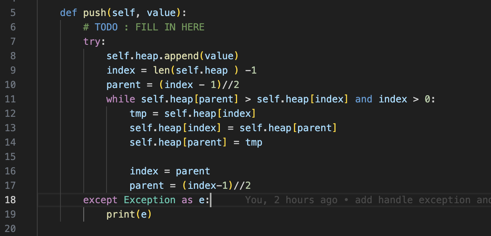
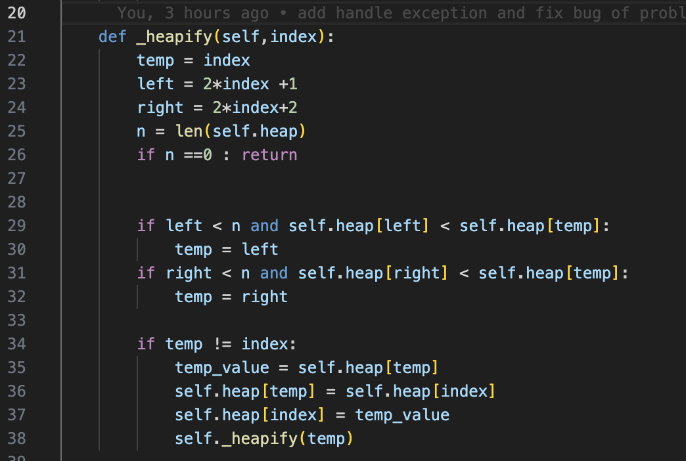
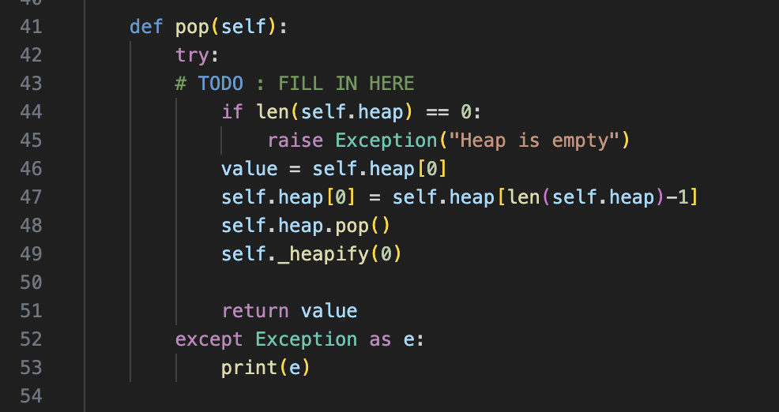
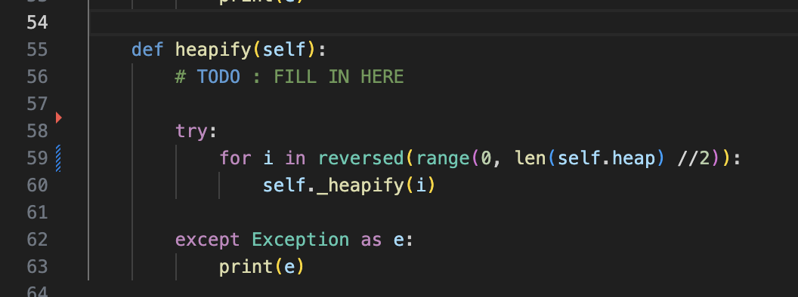
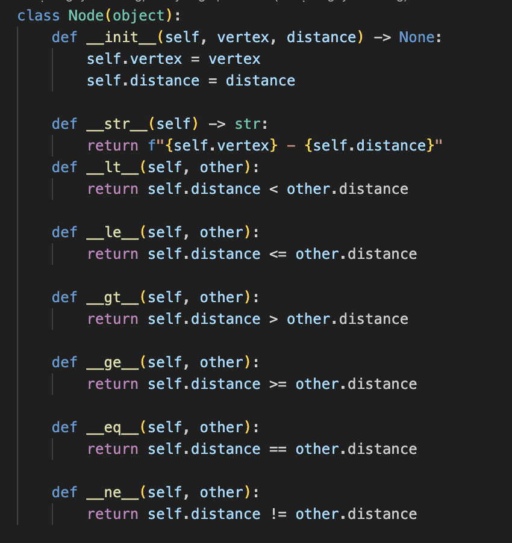
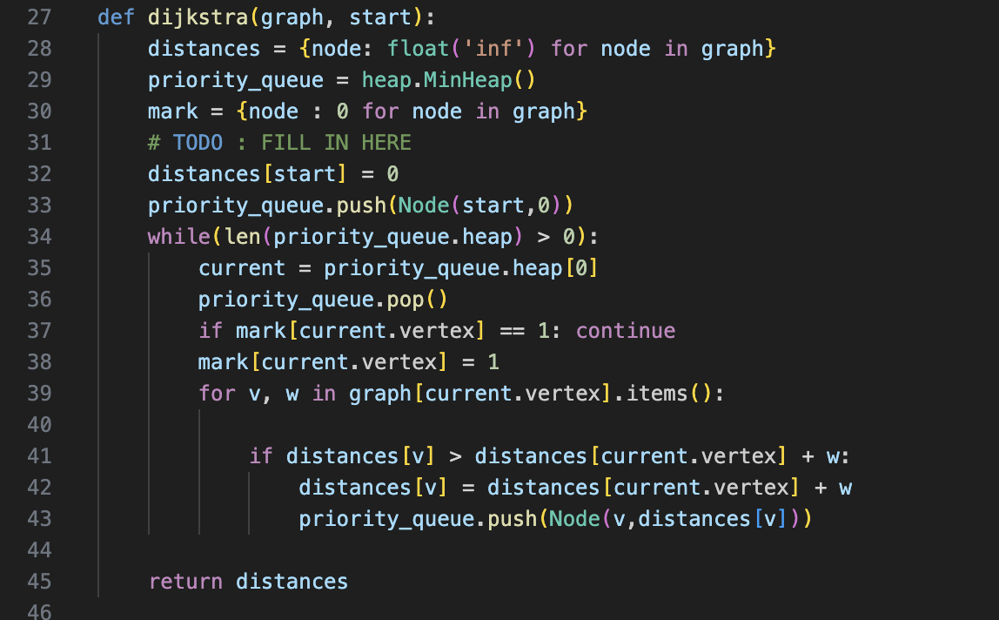

# Precourse 2

## Problem 1

### 1. Min Heap

Min heap is a complete binary tree, that for any given node C and its parent P, the key of P is always less or equal key of C.

A heap data structure can be represented as an array in which, for each node ```i```, its left and right child will be at ```2*i +1``` and ```2*i+2``` position.

In this exercise, we need to implement three functions of heap data structure to ensure the heap's property after each operation.

#### push

The ```push()``` function is used to push a new element to a heap while still ensuring heap's property. The procedure of ```push()``` is described as follow:

```
1. append new value to the end of array
2. start at the end of the array, compare current node with its parents
3. if the parent is greater than current node then swap it
4. repeat step #2 and #3 until the heap property is satisfied or the root node has been swapped.
```



With this procedure, we start from the end of array and the index will be divided by 2 each step, so the time complexity of algorithm is O(log n) with n is the size of array.

#### _heapify() a node

This is an common function which will be used in ```pop()``` and ```heapify``` function. This function will compare the current node with its children and swap until it less than its children.



The time complexity of this function is O(log n) with n is the size of heap, because the index will be multiplied by 2 at each step until it out of array.

#### pop

The ```pop()``` is used to delete the smallest element of an array. The procedure to pop is described as follow:

```
1. get the smallest value of the heap
2. replace the first element by the last element of the heap
3. remove the last element
4. do the _heapify() on the first element
```



The time complexity is equal to the _heapify() - O(log n).

#### heapify

This function is used to transform an array to heap structure. This task can be done by apply ```_heapify()``` on all none-leaf node in bottom-up order.



In this function, the ```_heapify()``` is called n//2 times. So the total time complexity upper bound of heapify is O(n log(n))

### 2. Dijkstra with min heap

Firstly, we will define some variables:

- distances[i] is shortest path from source node to node *i*
- mark[i] let us know node *i* is visited or not.
- graph[i][j] is the edge of graph, the distance from node *i* to node *j*.

The dijkstra algorithm can be describe as follow:

1. Mark all node are unvisited and the distances[i] is 0 if *i* is source node else *infinity*.
2. For current node *i*, find all of its unvisited neighbors. For each unvisited neighbor *j* if distances[j] > distances[i] + graph[i][j] then update distances[j] = distances[i] + graph[i][j].
3. When we are done consider all unvisited neighbors, set mark[i] = True so current node *i* is marked visited. This node will never be considered again.
4. If all node of graph is visited the algorithm has finished.
5. Otherwise, select in the unvisited nodes that has the smallest distance from source and set it as current node, then repeat from step #2.

The time complexity of above algorithm is O(V^2) with V is number of vertex or node of graph. This is because we need to do 2 loops, the first loop is find the unvisited node that has smallest distance from source, then the second loop, we need to for all of its neighbors.

The step #5 can be optimized using priority queue - min heap instead of using a for loop to find unvisited node has smallest distance from source. The dijkstra algorithm with min-heap can be describe as follow:

1. Mark all node are unvisited and the distances[i] is 0 if *i* is source node else *infinity*.
2. Create a min heap, each element in heap is a set of 2 value (vertex, distance), vertex is name of node, distance is the distance from source to that node. The distance will be used to compare in heap structure.
3. Push the source element to heap with distance = 0.
4. pop() the heap until get the unvisited node, this step can result in unvisited node has smallest distance from source node. This node is set as current node *i*.
5. for all neighbor *j* of current node *i*, if distances[j] > distances[i] + graph[i][j] then update distances[j] = distances[i] + graph[i][j] and push (j, distance [j]) even if *j* is already in heap.
6. repeat from step 4 until the heap is empty, the algorithm is finished.

To use the previous heap implementation, need to create a node data structure that contains vertex and distance attributes and override compare method. The Node class is implemented as follow:



With this Node implementation, when compare each element in heap, it will compare the distance.

The python implementation of Dijkstra:



The time complexity of push and pop element in heap is O(log(V)), and we need to do this process E times with E is number of edge in graph, so the time comlexity of this algorithm is O(E log(V)).

(*) The maximum number of edge in a graph is V^2, so the min heap is only better if the graph is sparse.

## Problem 2
