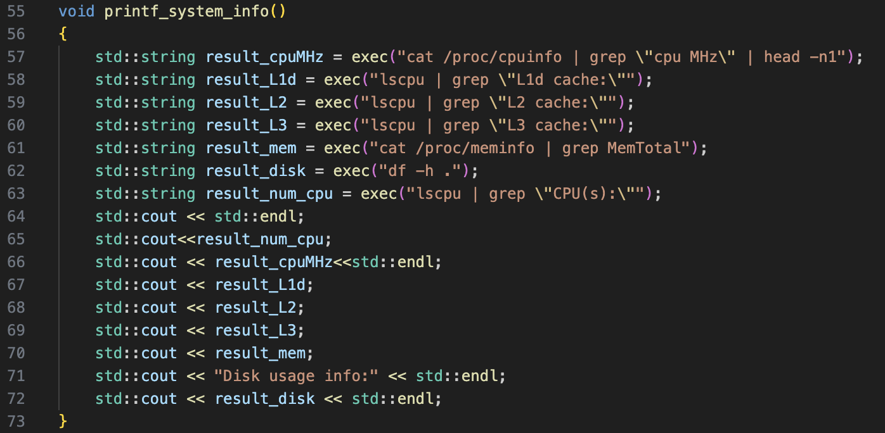
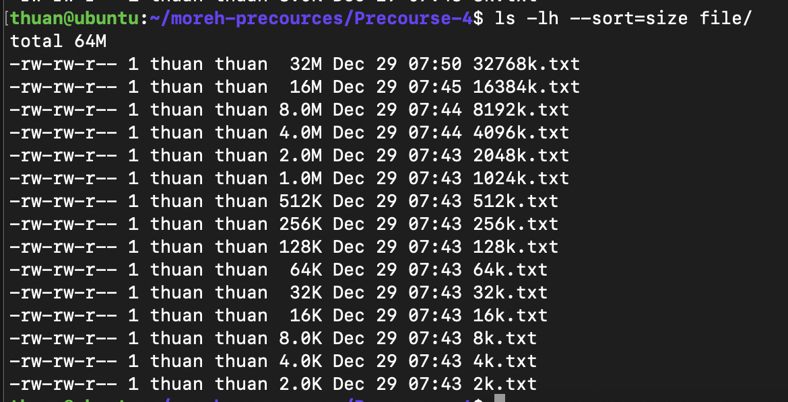

# Precourse 4

## Installation instruction

## Get system informations

To get system info from filesystem, I create a helper function to execute a command then push stream output to string buffer. This string will be used to display system info.


Then apply the `exec()` to get result



The output terminal after executing `printf_system_info()` is


I run this code in VM with 2 core cpu and 2GiB RAM. This VM is ubuntu x86_64 architecture virtualization, run on Mac M1 chip, so the benchmark result can be unstable.

## Benchmark the cache

Follow the cache size in the above output terminal, total cache is ~ 33Mb. So for this benchmark, the buffer size is set increase from 2kb to 32mb exponentially, the stride is set from 1 to 31 with range 2 between 2 stride. To measure the bandwidth, I access the memory multiple times and use the `std::chrono` to measure execution time. The more runs step, the more stable the result is. For this benchmark, I repeat access whole buffer 1000 times.

The algorithm to access buffer with `stride` is described as follow:


I define a `volatitle` variable and assign result for it, this trick can tell the compiler not to optimize the loop. The function to measure the bandwidth is described as follow:


We have the equation to calculate the bandwidth:

```
Bandwidth (MB/s) ~= total bytes read (bytes) / total execution time (micro seconds)

total bytes read = (size of buffer) * (number of runs) / stride

```

The logic for benchmark the latency is a bit different:


We calculate the latency (nano second) by divide total execution time with total number of element accessed. `MAXRUNS` is set to 100 so `MAXRUNS * 10` mean we will run 1000 times then get the average number. The output terminal for benchmark cache is showed as follow:


## Benchmark the DRAM

To benchmark DRAM, I use the same logic with benchmark cache, but increase the buffer size from 64Mb to 512 Mb, So that the array have to store in main memory. To test DRAM benchmark, I use multi thread to run both 2 cpu to access memory at the same time, and because I only read the array to get elements without changing them, So I don't need to lock array when a thread access it.


I create 2 thread to use 2 cpu, and wait until both 2 threads finish their jobs to measure execution time.

The output result in terminal is


## Disk benchmark

In this section I will benchmark by read file with different size from 2kb to 32 Mb, run the test multiple times and then get the average result. The file is text format contains random latin characters.



This is an example content of 1 text file


The bandwidth is calculated by `total file size read divide/total execution time`, this is the result of output terminal


